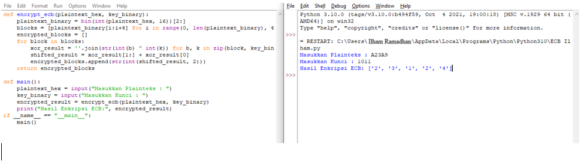

# ECB-Kripto

## Apa itu Electronic Code Book (ECB) ?

  Electronic Code Book (ECB) adalah salah satu mode operasi pengenkripsian blok yang digunakan dalam kriptografi blok, yang mengacu pada cara mengenkripsi teks terbuka (plaintext) menjadi teks sandi (ciphertext) dalam blok-blok data yang sama tanpa melibatkan blok sebelumnya. ECB mengenkripsi setiap blok plaintext secara terpisah dan independen satu sama lain, tanpa bergantung pada blok sebelumnya.

### Input dan Output

<p>Plainteks Hex yang akan dimasukan : <b>A23A9</b> | Kunci Biner yang akan dimasukan : <b>1011</b></p>




### Fungsi 
```
def encrypt_ecb(plaintext_hex, key_binary):
    plaintext_binary = bin(int(plaintext_hex, 16))[2:]
    blocks = [plaintext_binary[i:i+4] for i in range(0, len(plaintext_binary), 4)]
    encrypted_blocks = []
    for block in blocks:
        xor_result = ''.join(str(int(b) ^ int(k)) for b, k in zip(block, key_binary))
        shifted_result = xor_result[1:] + xor_result[0]
        encrypted_blocks.append(str(int(shifted_result, 2)))
    return encrypted_blocks
```
